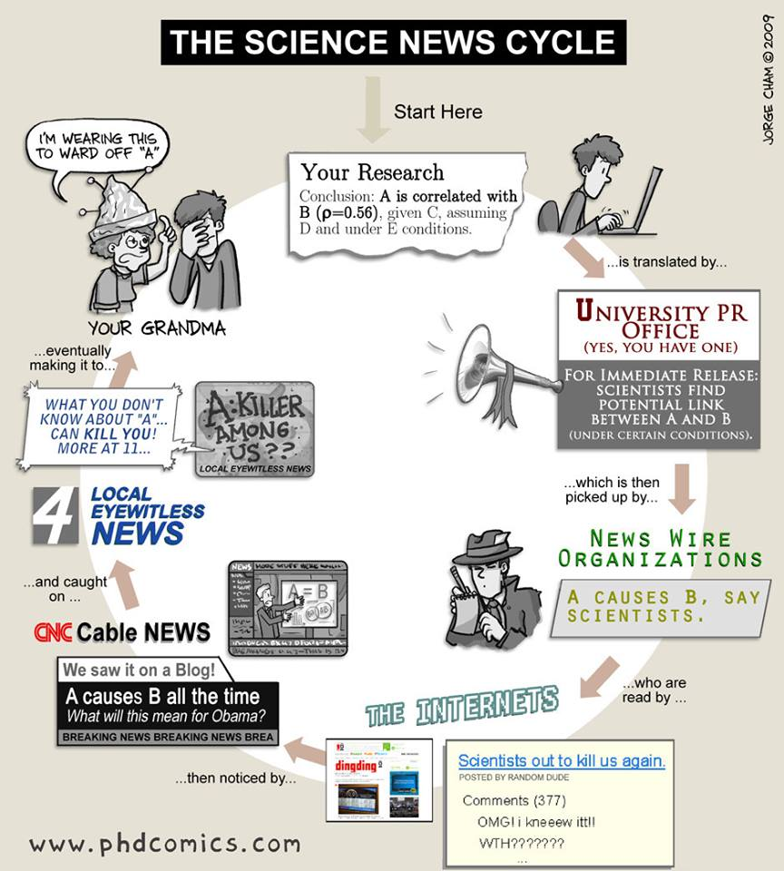

<!---->

The pace of scientific research today is tremendous, from biology to astronomy, from engineering to medicine. Yet there is a communication gap between the science done in a laboratory and newspaper articles or public policy. 

In this course we will look at the history of science and at current academic and popular science writing to understand how we talk about scientific truth. We will consider why inaccessible writing sounds truthful and how popular writers use scientific facts to draw unlikely conclusions. We will then look at contemporary science writers who are effective in communicating the importance of new ideas while staying true to scientific rigor in order to identify ways of doing science writing right. 

Intended for science majors and non-majors alike, this course will give students tools for reading scientific writing critically. At the same time, students in this course will be asked to conduct research and produce original writing, including a scholarly essay and a portfolio of journalistic pieces, so that by the end of the course students will be confident science writers.

You will learn how to:

1. identify, evaluate, construct, and organize effective arguments
2. read science writing critically
3. write about scientific research responsibly
4. conduct library and web-based research and document sources
5. produce a clean, efficient style and adapt it to various rhetorical situations
6. edit and proofread your own and others’ prose.